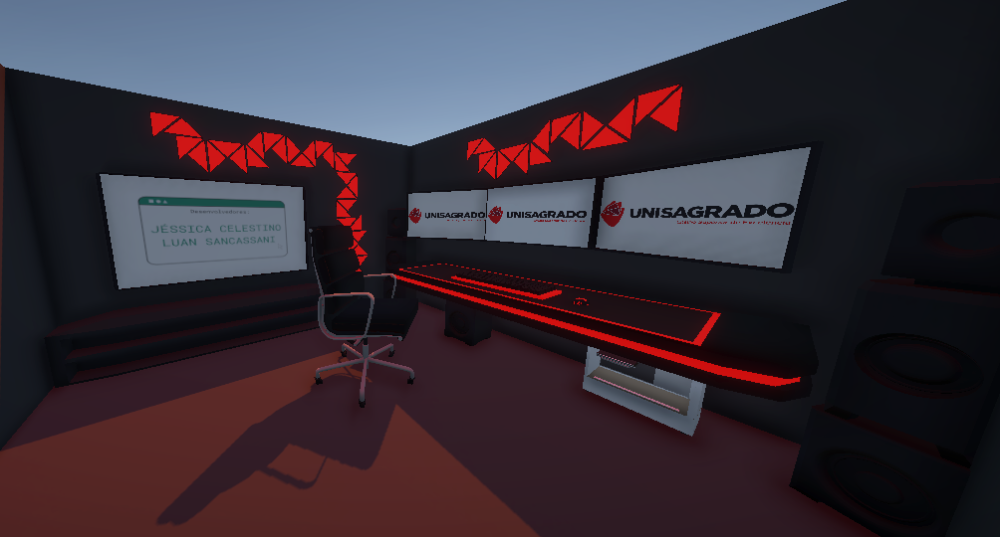

   

 

   
   

 

[**Sobre**](#-sobre) **|**
[**Screenshots**](#%EF%B8%8F-screenshots) **|**
[**Ferramentas Utilizadas**](#-tecnologias-e-ferramentas-utilizadas) **|**
[**Instalação**](#%EF%B8%8F-instala%C3%A7%C3%A3o) **|**
[**Desenvolvedores**](#-desenvolvedores)

## 📝 Sobre:
O projeto proposto na matéria de realidade virtual é uma simulação de uma sala de computador projetada para fornecer um ambiente virtual em que o usuário pode olhar em volta e ver objetos comuns de um ambiente de trabalho ou de jogos. A plataforma pode ser usada para fins educacionais.

## 🖼️ Screenshots:

## 💾 Tecnologias e Ferramentas Utilizadas:

<table>
  <tbody>
    <tr>
      <td style="font-weight: bold">Unity</td>
      <td>
        <a href="https://unity.com" target="_blank">Download</a>.
      </td>
    </tr>
    <tr>
      <td style="font-weight: bold">Blender</td>
      <td>
        <a href="https://www.blender.org/" target="_blank">Download</a>.
      </td>
    </tr>
  </tbody>
</table>

## ⚙️ Instalação:
1. Clone o repositório;
2. Abra o Unity Hub, na aba `Projects`, selecione `Open` e procure o local armazenado;
3. Espere baixar as dependências.

## 💻 Desenvolvedores:

- [@jescacelestino](https://github.com/jescacelestino)
- [@LuanR44](https://github.com/LuanR44)
